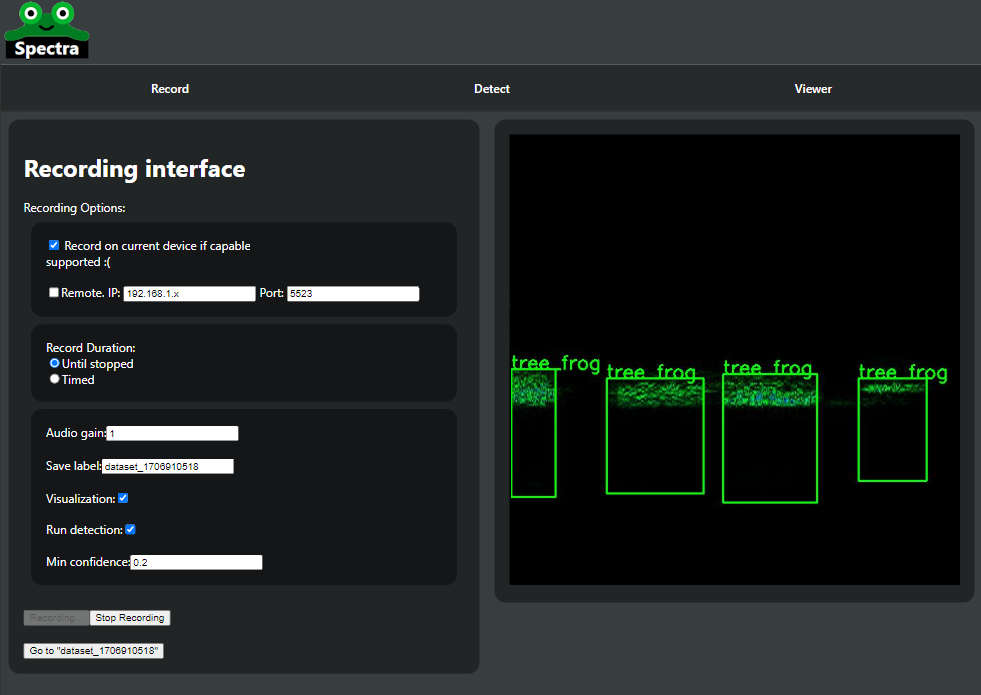
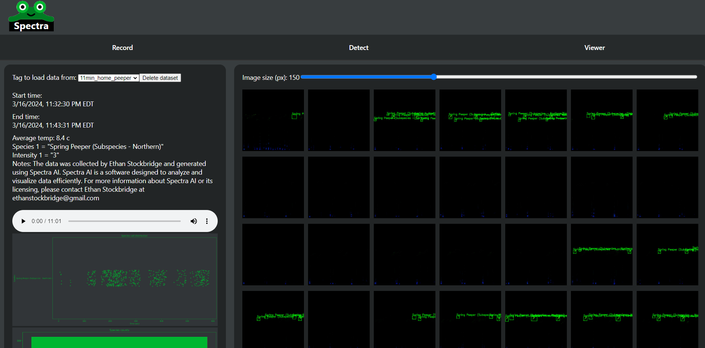
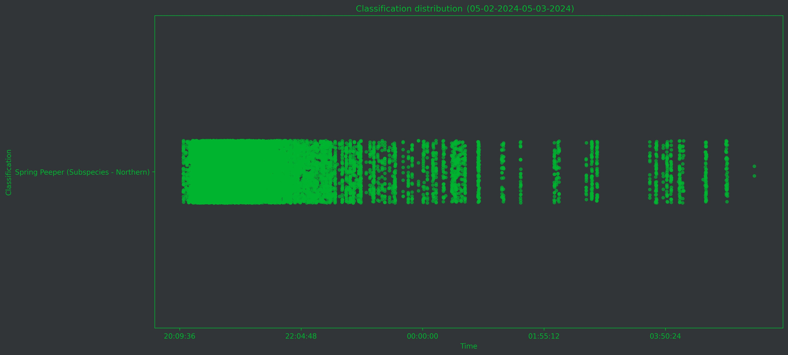
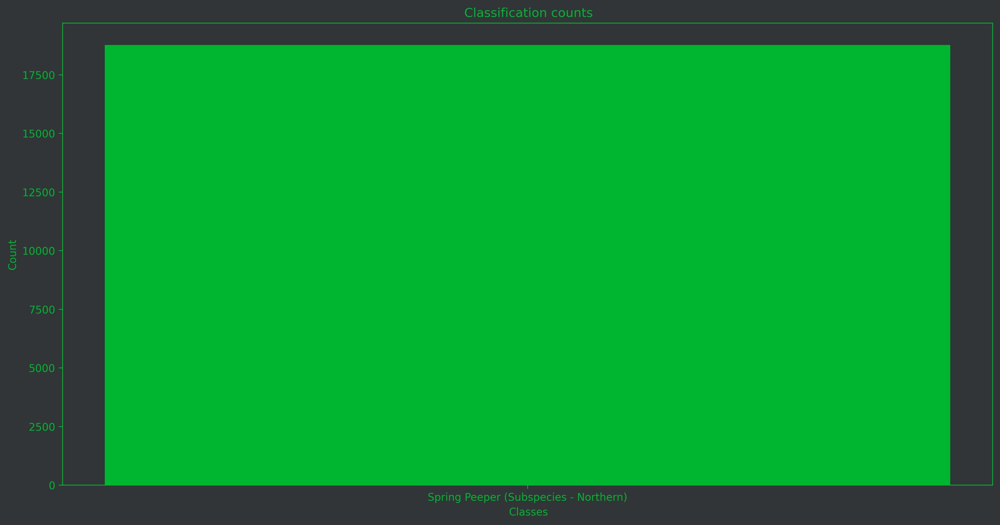
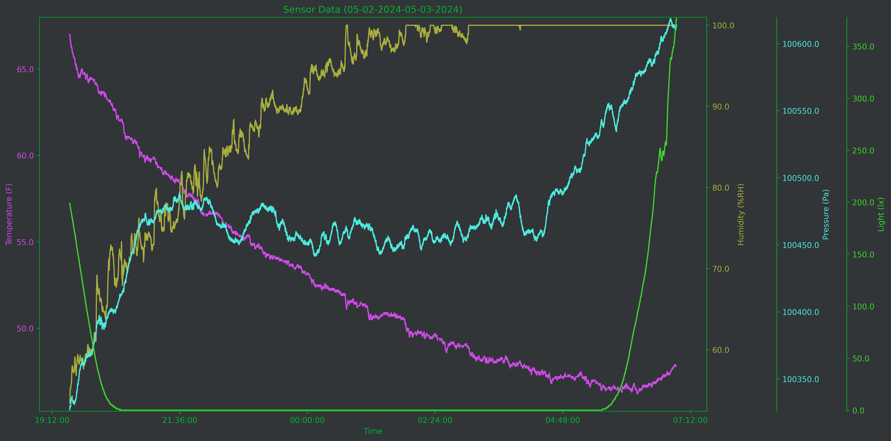
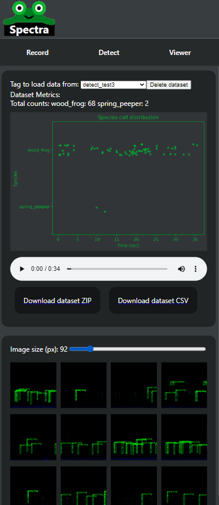
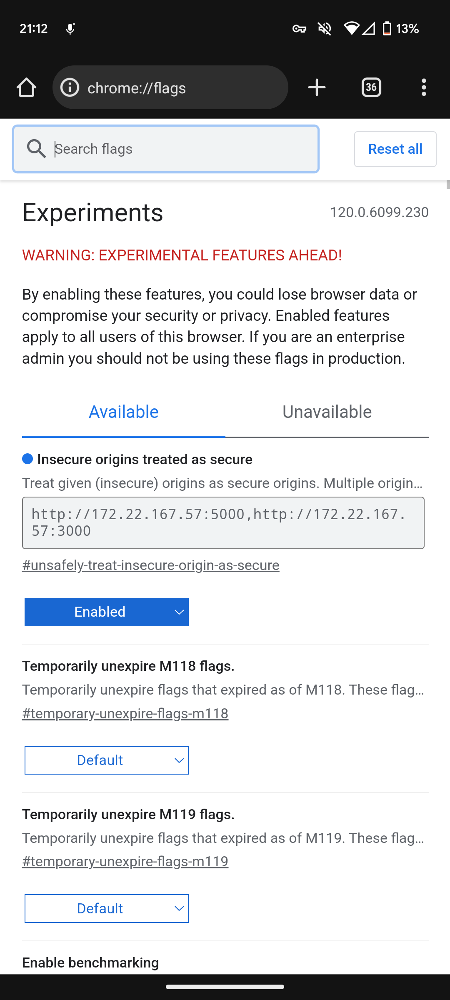

# Introduction
Spectra is an artificial intelligence software that can identify the sound of multiple different classes, all at once!  
Spectra identifies classes, generates sensor data graphs, and more.  
Running on a cutting edge, yolo-based backend, this software is quick and efficient.  
The below examples are showing how this can be used to identify multiple classes.  
The output contains a csv with all class identifications as well as sensor data interpolated from those detection times. Additionally, graphs are generated for easy identification and visualization. 
Please note that this repository is coded in my free time with no funding, and thus may contain bugs.  
Please see the associated [Core](https://github.com/ethanstockbridge/Spectra-Core) and [UI](https://github.com/ethanstockbridge/Spectra-UI) framework, which allows users to easily access the user interface on any browser.

# React info:
This project was bootstrapped with [Create React App](https://github.com/facebook/create-react-app).

### Running the project:
`npm start`

Runs the app in the development mode.  
Open [http://localhost:3000](http://localhost:3000) to view it in your browser.

The page will reload when you make changes.\
You may also see any lint errors in the console.

### IP configuration
You *may* want to change the ip configuration for running the application, this is located in the api.js file. It is recommended to use the default http://localhost:5000/api/ api, as this is easiest for testing. Be sure to match this API endpoint url to flask's *actual* launched IP.  
Alternative to the default, if you are using an SD-WAN service such as [ZeroTier](https://www.zerotier.com/) then you can put the IP of your HOST computer there. Please see api.js *and* [Spectra-Core](https://github.com/ethanstockbridge/Spectra-Core/blob/main/start_server.py)'s configuration for the hosted IP, as I have already put an example there.

# Website UI
The website UI was designed with simplicity in mind, and an easy to use interface with each tab: Record, Detect, and view

- Record: Use your device's microphone to record the current audio, and this will be sent to the server and saved in the dataset database
- Detect: Use a pre-recorded audio file to run detection on, this allows you to use any audio file and see what classes are detected
- View: This allows you to view important information such as the classes detected, frequency of detection, and view the detected images, listen to the audio

### Record tab
  

### View tab

### Examples of resulting output graphs:
| Distribution graph | Class counts | Class graph |
|--------------------|--------------|-------------|
||||

# Additional information

### Mobile compatibility

The mobile website has been made to be reactive to the screen size, as you can see below:
  

### Mobile recording, 

Please note that in order to record on mobile with this server, you **must** enable "insecure origins treated as secure" for the servers used. This allows http websites to act like https websites, which is required for mobile google chrome to access your microphone, so be sure to only grant known sources, as it decreases security otherwise.
 
To do this, your mobile device must be using chrome, and go to [chrome flags](chrome://flags/), and add the appropriate websites to your device's trusted list. An example is given below: 
  
  

In this example, the website is hosted at http://172.22.167.57:5000 and the react server is hosted at http://172.22.167.57:3000, and the option is **enabled**.  
An alternative options is to implement https to the server and frontend, but that is out of the scope of this locally hosted project...
